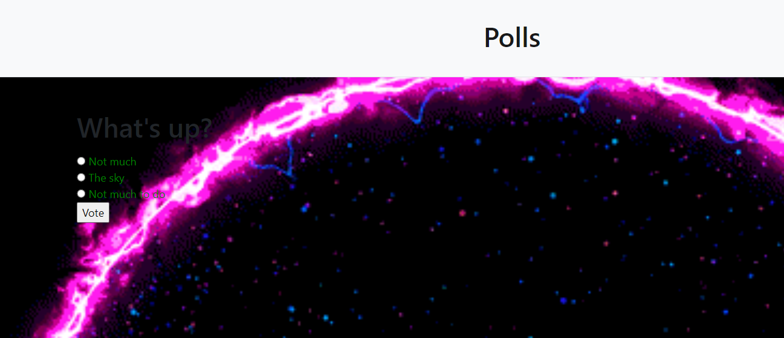

https://docs.djangoproject.com/en/4.0/intro/tutorial01/

Just for the record, the dir \polls-original-APP includes the whole polls APP and the dir \polls-as-pacakage includes the files that should be installed with pip install.
It is an example of using Django-apps as pacakages. 

The SECRET_KEY should be defined in the file .env.example and then renamed to .env

The poll-App includes also Django unity test cases. 

=====
Polls
=====

Polls is a Django app to conduct web-based polls. For each question,
visitors can choose between a fixed number of answers.

Detailed documentation is in the "docs" directory.

Quick start
-----------

1. Add "polls" to your INSTALLED_APPS setting like this::

    INSTALLED_APPS = [
        ...
        'polls',
    ]

2. Include the polls URLconf in your project urls.py like this::

    path('polls/', include('polls.urls')),

3. Run ``python manage.py migrate`` to create the polls models.

4. Start the development server and visit http://127.0.0.1:8000/admin/
   to create a poll (you'll need the Admin app enabled).

5. Visit http://127.0.0.1:8000/polls/ to participate in the poll.

---

**Examples of views from the Polls website:** 

---

***The home page with the polls question.*** 
 

---

***Question / Vote view in the polls.*** 
 

---

***Results view after voting.*** 
 
